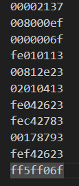

# 1.前言
这是一个用来自学risc-v以及soc设计的小项目，初衷是从零开始搭建处理器，在此感谢B站up主外瑞罗格以及tiny-risc-v项目

# 2.项目简介 
1. 目前支持rv32im
2. 四级流水（比no-bram版本多了一级取指）
3. 简单的C语言程序运行
4. 通过Xilinx的block memory generator生成的双口bram实现rom,寄存器实现ram

# 3.仿真
目前仿真通过vivado实现

仿真所需的文件在/sim中

新建项目后分别添加/rtl与/sim中的所有文件

tb.v中通过`$readmemh("*.txt",tb.u_rom.rom_mem);`将指令导入内存中，根据工程路径调整

进行行为级仿真

/sim/inst_txt和/sim/generated中是一些指令测试代码，具体用法可以参考外瑞罗格的视频以及tiny-risc-v项目

# 4.交叉编译与C语言代码运行

## 4.1交叉编译环境准备：

Linux系统：Ubuntu 22.04

1. 下载工具链

```
sudo apt update
sudo apt install build-essential gcc make perl dkms git gcc-riscv64-unknown-elf gdb-multiarch qemu-system-misc
sudo apt install gcc-riscv64-linux-gnu
```

2. 配置环境变量

在.bashrc中添加

`export PATH=$PATH:/usr/lib/riscv64-unknown-elf/bin`

## 4.2编译

test.c中是一个简单的示例（复杂的例子我还没试）

修改其中的代码直接make就行

复杂代码的编译要自己写makefile和link

## 4.3运行

1. 将编译生成的test.txt修改成只包含机器码的形式（要是有好心人能用python帮我写一个就好了）



2. 将test.txt放到/sim中，即可用vivado进行运行与仿真

3. 通过txt_to_coe.py将txt转为coe，为Xilinx生成的bram设置初始值

由于现在没有接外设，输出只能从寄存器和内存来看了


# 5.更新日志：

先实现add 
2024/11/19 实现立即数和寄存器add I type和r type待补全 立即数扩展还没做

开始分支

2024/11/20 完成branch与立即数拓展

2024/11/22 complete I/R/J/B type instructions

2024/11/26 简单完成load/store指令

2024/11/29 添加乘法器

2025/01/15 完成除法器的算法逻辑，实现自己编译的C语言在cpu上运行

2025/01/16 添加start.s用于设置sp寄存器，添加makefile

2025/02/25 完成rv32m

2025/02/28 忽略存储器后（ram和rom）可综合
